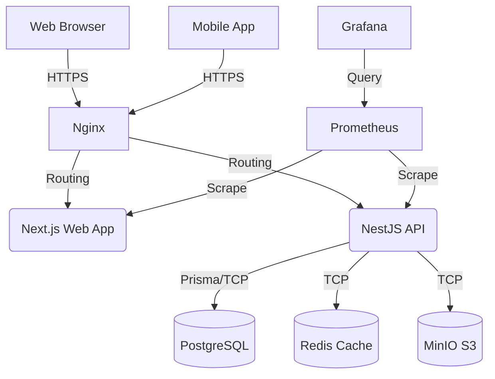

# 02 - System Architecture

## High Level Architecture
BuildTrack utilizes a modern, decoupled micro-architecture deployed via Docker. The system is split into independent services communicating over a secure internal Docker network, exposed to the outside world via an Nginx Reverse Proxy.

## Frontend (Web)
Located in `apps/web`. Built using **Next.js** (App Router). It handles server-side rendering for SEO and performance, and client-side interactivity using React Hooks, TailwindCSS for styling, and Lucide React for iconography.

## Mobile App
Located in `apps/mobile`. Built using **Expo / React Native**. It uses `@tanstack/react-query` for data fetching and caching, communicating directly with the NestJS API via Axios.

## Backend (API)
Located in `apps/api`. Built using **NestJS**. This is the core logic layer. It exposes RESTful endpoints, handles JWT authentication, validates payloads, and manages business logic (e.g., ensuring a loan repayment does not exceed the outstanding balance).

## Database & Caching
- **PostgreSQL**: The primary relational database holding all state (Projects, Users, Loans, Tasks). Accessed exclusively by the API via Prisma ORM.
- **Redis**: Used for rate limiting (`THROTTLE_TTL`), session caching, and background job queuing.
- **MinIO**: S3-compatible object storage for file uploads (site photos, receipts, contracts).

## Infrastructure & Monitoring
- **Docker Compose**: Orchestrates all 7 containers (`nginx`, `web`, `api`, `postgres`, `redis`, `minio`, `prometheus`, `grafana`).
- **Nginx**: Acts as the API Gateway and SSL terminator.
- **Prometheus/Grafana**: Scrapes metrics from the Node.js services to monitor CPU, memory, and HTTP response times.
