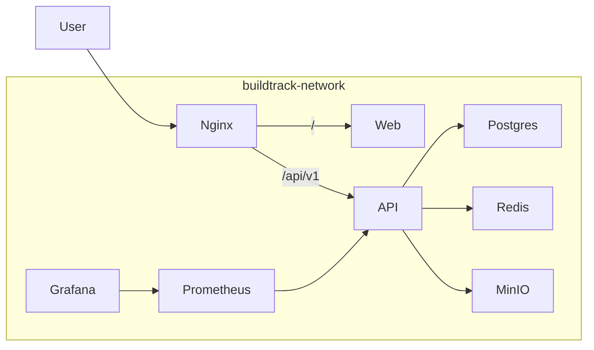

# 08 - Docker Architecture

BuildTrack uses Docker Compose to orchestrate its production environment. This ensures that the application behaves identically regardless of the host operating system.

## Containers

The architecture consists of 7 tightly integrated containers:

1. **`buildtrack-nginx`**: The entrypoint to the system. Routes HTTP/HTTPS traffic to the Web and API containers based on the URL path.
2. **`buildtrack-web`**: Next.js frontend running in production mode.
3. **`buildtrack-api`**: NestJS backend processing logic and DB queries.
4. **`buildtrack-postgres`**: PostgreSQL 16 database.
5. **`buildtrack-redis`**: Redis 7 for caching and rate limiting.
6. **`buildtrack-minio`**: Self-hosted S3-compatible object storage.
7. **`buildtrack-prometheus` & `buildtrack-grafana`**: The monitoring and observability stack.

## Docker Network

All containers are bound to a custom bridge network called `buildtrack-network`.
This ensures secure, isolated communication. For example, the `buildtrack-web` container cannot query `buildtrack-postgres` directly; it must request data via `buildtrack-api`.

## Volumes

Docker Volumes are used for data persistence so that stopping or rebuilding containers does not destroy data.
- **`pgdata`**: Stores PostgreSQL database files.
- **`redisdata`**: Stores Redis append-only files (AOF).
- **`miniodata`**: Stores uploaded images and documents.
- **`prometheusdata`** & **`grafanadata`**: Stores metrics and dashboard configurations.

## Build Process & Images

The `web` and `api` containers are built from local `Dockerfile`s located in `apps/web` and `apps/api`.
These Dockerfiles utilize **multi-stage builds**. 
1. **Builder Stage**: Installs all dependencies (including `devDependencies`), runs TypeScript compilation, and generates Prisma clients.
2. **Production Stage**: Copies only the compiled JavaScript and `node_modules` required for production, resulting in highly optimized, lightweight Alpine Linux images.

## Startup Flow

Docker Compose uses `depends_on` with `condition: service_healthy` to ensure containers start in the correct order.
1. `postgres` and `redis` start first.
2. `api` waits until Postgres and Redis accept TCP connections.
3. `web` waits until the API exposes the `/api/v1/health` endpoint.
4. `nginx` starts once `web` and `api` are fully online, ensuring users don't encounter 502 Bad Gateway errors during startup.
