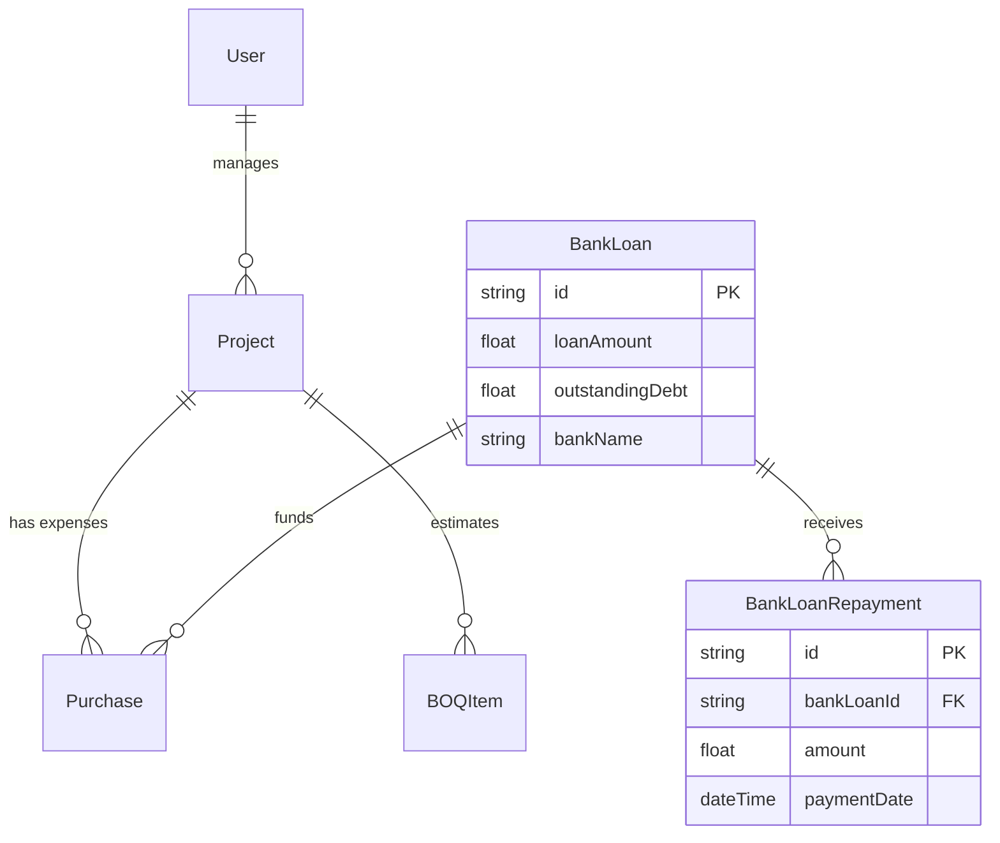

# 09 - Database Design

BuildTrack relies on PostgreSQL as its primary data store, managed exclusively through the **Prisma ORM**. The schema is defined in `apps/api/prisma/schema.prisma`.

## Core Tables and Domain Models

### 1. User & Auth
- **`User`**: Core table for authentication and RBAC (Role-Based Access Control). Contains `email`, `password` (hashed), and `role` (Enum: `SUPER_ADMIN`, `PROJECT_MANAGER`, `FINANCE_MANAGER`, etc.).

### 2. Projects & BOQ
- **`Project`**: Represents a construction site. Contains `budget`, `progressPercent`, `startDate`, `endDate`, and `status`.
- **`BOQItem`** (Bill of Quantities): Represents estimated costs for specific categories (e.g., Concrete, Steel). Relates to `Project`.

### 3. Finance & Treasury
- **`BankLoan`**: Represents a facility granted by a financial institution. Contains `loanAmount`, `interestRate`, `outstandingDebt`, and `status`.
- **`BankLoanRepayment`**: A highly critical table tracking payments made against a loan to reduce its principal/outstanding balance. Relates to `BankLoan` (Many-to-One).
- **`Purchase`**: Represents expenses (materials, subcontracts). Relates to `Project` (where it was used) and optionally `BankLoan` (if the purchase was funded via a specific loan facility).

### 4. Human Resources & Execution
- **`Worker`**: Daily wage workers.
- **`DailyLog`**: Logs submitted by Site Supervisors containing hours worked, weather conditions, and progress photos.

## Entity-Relationship (ER) Diagram

## Indexes & Performance
Prisma automatically creates standard foreign key indexes. Additional indexes (`@@index`) should be placed on frequently queried fields, such as `projectId` inside the `Purchase` table, as the Finance Dashboard aggregates purchases by project extensively.

## Migration Strategy
We use Prisma Migrate for schema evolution.
1. Modify `schema.prisma`.
2. Run `npx prisma migrate dev --name <description>`. This generates a `.sql` file in the `prisma/migrations` folder.
3. Commit the SQL file to version control.
4. In production, the CI/CD pipeline runs `npx prisma migrate deploy` to safely apply the SQL to the PostgreSQL instance without wiping data.
