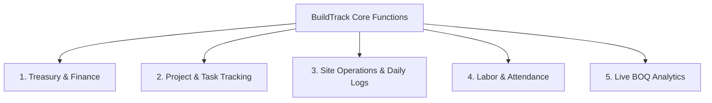
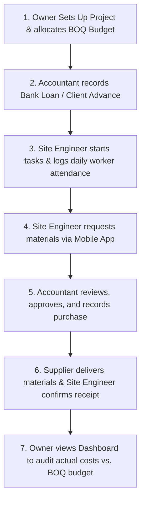

# 🏗️ BuildTrack — Functional Guide & Core Features

Welcome to the overall system guide for **BuildTrack**, a construction project management, finance, and treasury tracking platform. This document explains the application's core functions, business modules, target users, and operational workflows.

---

## 1. System Overview

BuildTrack is a management software that connects **on-site field operations** (daily progress, material requirements, labor) with **head office operations** (financial audits, budget tracking, treasury management). 

The system operates across three interfaces:
1. **The Web Dashboard:** Used by directors, administrators, and accountants for deep financial tracking, setting project targets, and approving expenses.
2. **The Mobile Field App:** Used by engineers, field managers, and subcontractors on the construction site to log daily progress, register workers, and request materials.
3. **The Core Business API:** Runs in the background to securely validate transactions, verify user permissions, and ensure data integrity.

---

## 2. Why & For What Was This Application Built?

We built **BuildTrack** to solve the high-risk, high-cost operational disconnect that happens when construction sites operate out of sync with accounting desks.

### ❓ WHY We Built It (The Problems Solved)
* **Financial Blindspots:** Traditional projects track finance on scattered paper or isolated spreadsheets. Owners lack instant visibility into drawn-down bank loan balances, available cash advances, and material expenditures.
* **Delayed Site Updates:** Daily site logs, worker check-ins, and subcontractors' progress reports take days to reach the office, making it impossible to address delays or resource shortages early.
* **Budget Creep:** Without live tracking of expenditures against the initial **Bill of Quantities (BOQ)**, project budgets overrun without warning.

### 🎯 FOR WHAT We Built It (Core Purpose by User Role)
BuildTrack provides a single source of truth, tailored for specific roles:
* **For Company Owners & Directors:** To view project status, current cash balances, revenue vs. cost trends, and system audit logs.
* **For Project Managers:** To assign tasks, monitor subcontractor performance, check inventory levels, and read daily site updates.
* **For Accountants:** To manage bank loan disbursements, record client advances, approve cash expenditures, and verify purchases.
* **For Site Engineers & Subcontractors:** To register worker profiles, log daily progress/blockages, and submit material requests instantly.

---

## 3. Core Functional Modules

The application is built around five core functional pillars:

### Module 1: Treasury & Finance Management
Handles the inflow and outflow of capital to ensure project liquidity:
* **Bank Loans Tracker:** Records total loan amounts, active drawdowns, remaining loan balances, interest rates, and payments.
* **Client Advances:** Tracks client payments made to initialize or sustain project phases.
* **Purchase Orders:** Logs material purchases, links them to specific suppliers, and records payment statuses (Paid, Partial, Unpaid).
* **Cash Expenses:** Allows field managers to upload cash expenses (e.g., transport, emergency items) for real-time accountant review and approval.

### Module 2: Project & Task Tracking
Organizes the timeline and milestones of each construction project:
* **Phases & Milestones:** Breaks projects down into distinct phases (e.g., Excavation, Slab Casting, Finishing).
* **Task Board:** Allows project managers to create, assign, and prioritize tasks with specific deadlines.
* **Subcontractor Assignment:** Links specific tasks to external subcontractors and tracks their progress.

### Module 3: Site Operations & Daily Logs
Translates field activity into real-time metrics for office oversight:
* **Daily Site Logs:** Field engineers log work completed, weather conditions, active workers on site, and issues causing delays (blockages).
* **Material Requests:** Field staff request materials (e.g., cement, steel) indicating quantity and urgency. These requests route straight to the accountant's desk for procurement.

### Module 4: Labor & Attendance Management
Tracks human resources on the field:
* **Worker Registry:** Records names, contact details, skill categories (e.g., mason, carpenter, helper), and wage details.
* **Check-in/Check-out Logging:** Tracks active hours on the site to calculate wages and evaluate labor cost efficiency.

### Module 5: Live BOQ Analytics
The core auditing module of the platform:
* **Bill of Quantities (BOQ) Mapping:** Maps the initial project budget targets.
* **Real-time Cost Comparison:** Automatically aggregates material purchases and labor expenses, comparing them against the BOQ targets to flag any overruns.

---

## 4. Key Operational Workflow

The diagram below maps how a typical operational cycle flows through the application:

