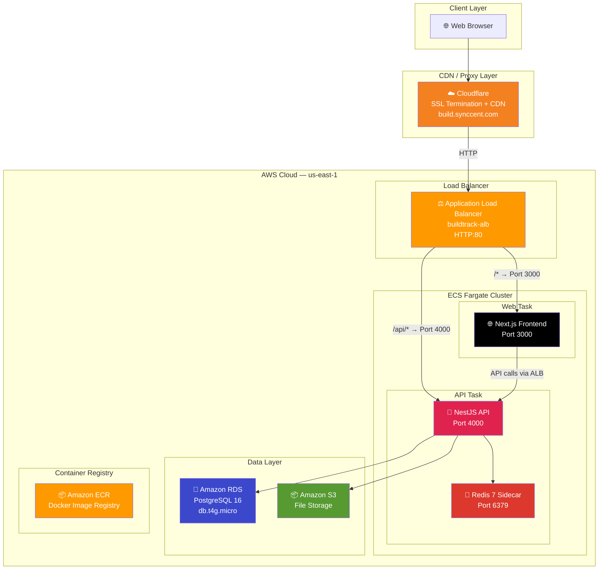
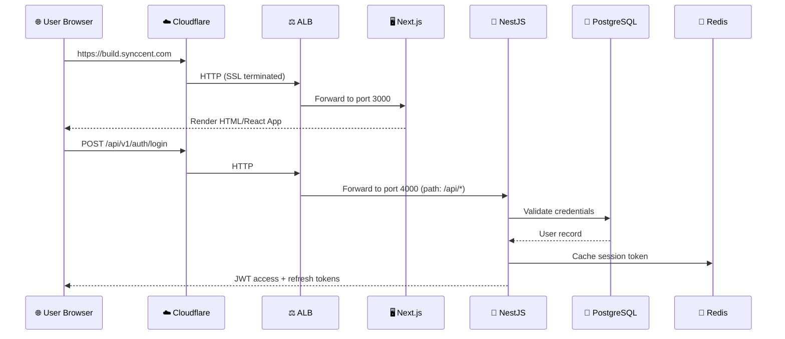

# BuildTrack — AWS Cloud Deployment Documentation

## Part 1: Architecture, Technology Stack & Design Decisions

---

## 1. Project Overview

**BuildTrack** is a full-stack **Construction Project Management SaaS Platform** built using a modern monorepo architecture. It enables construction companies to manage projects, track daily site reports, handle finances, manage workers and attendance, control materials/inventory, and generate analytics dashboards.

### Key Business Modules
| Module | Description |
|:---|:---|
| **Authentication** | JWT-based login, registration, role-based access (Owner, PM, Engineer) |
| **Projects** | Create, update, and track construction projects with milestones |
| **Daily Reports** | Site engineers submit daily progress reports with photo uploads |
| **Finance** | Budget tracking, expense approvals, bank loan management |
| **Materials** | Inventory management, purchase orders, stock tracking |
| **Workers** | Worker profiles, attendance tracking, advance payments |
| **BOQ (Bill of Quantities)** | Cost estimation and quantity surveying |
| **Subcontractors** | Manage subcontractor contracts and payments |
| **Dashboard** | KPI analytics, charts, and real-time project health metrics |
| **Notifications** | Real-time WebSocket notifications across the platform |

---

## 2. Application Architecture

### 2.1 High-Level Architecture Diagram



### 2.2 Request Flow



---

## 3. Technology Stack

### 3.1 Frontend — Next.js 16 (React 19)

| Technology | Version | Purpose |
|:---|:---|:---|
| **Next.js** | 16.2.9 | React meta-framework with SSR, SSG, and API routes |
| **React** | 19.1.0 | UI component library |
| **TailwindCSS** | 4.x | Utility-first CSS framework |
| **TanStack React Query** | 5.x | Server state management, caching, and data fetching |
| **Zustand** | 5.x | Lightweight client-side state management |
| **React Hook Form + Zod** | 7.x / 4.x | Form management with schema-based validation |
| **Axios** | 1.x | HTTP client for API communication |
| **Lucide React** | 1.x | Icon library |
| **shadcn/ui** | 4.x | Pre-built accessible UI components |

**Why Next.js?**
> Next.js provides **Server-Side Rendering (SSR)** for SEO and initial load performance, **file-based routing** for rapid development, **built-in image optimization**, and **API route proxying**. Version 16 with Turbopack offers significantly faster build times compared to Webpack.

### 3.2 Backend — NestJS 11 (Node.js 20)

| Technology | Version | Purpose |
|:---|:---|:---|
| **NestJS** | 11.x | Enterprise-grade Node.js framework (modular architecture) |
| **Prisma ORM** | 6.14.0 | Type-safe database ORM with migrations |
| **Passport + JWT** | 0.7 / 11.x | Authentication strategy (access + refresh tokens) |
| **BullMQ** | 5.x | Redis-backed background job queue |
| **Socket.io** | via NestJS | Real-time WebSocket notifications |
| **Helmet** | 8.x | HTTP security headers |
| **AWS SDK v3** | 3.700+ | S3 presigned URL generation for file uploads |
| **bcrypt** | 5.x | Password hashing |
| **class-validator** | 0.14 | DTO validation with decorators |

**Why NestJS?**
> NestJS enforces a **modular, enterprise-grade architecture** inspired by Angular. It provides built-in support for **dependency injection**, **guards**, **interceptors**, **middleware**, and **WebSockets**. This makes the codebase maintainable, testable, and scalable — critical for a SaaS platform with 15+ feature modules.

### 3.3 Database — PostgreSQL 16

**Why PostgreSQL?**
> PostgreSQL is the industry standard for **relational data** with complex relationships (projects → tasks → daily reports → materials). It offers:
> - **ACID compliance** for financial transactions (expenses, budgets, payments)
> - **Advanced indexing** (B-tree, GIN) for search performance
> - **JSON support** for semi-structured data
> - **Battle-tested** reliability in production environments

### 3.4 Cache Layer — Redis 7

**Why Redis?**
> Redis provides **sub-millisecond in-memory caching** for:
> - JWT session blacklisting (logout invalidation)
> - BullMQ job queue processing (background tasks)
> - Frequently accessed data caching (dashboard KPIs)
> - WebSocket pub/sub for real-time notifications

---

## 4. Monorepo Structure

```
buildtrack/
├── apps/
│   ├── api/                    # NestJS Backend (Port 4000)
│   │   ├── src/
│   │   │   ├── modules/        # Feature modules (auth, projects, tasks, etc.)
│   │   │   ├── common/         # Shared guards, decorators, filters
│   │   │   └── main.ts         # Application bootstrap
│   │   ├── prisma/
│   │   │   └── schema/         # Multi-file Prisma schema
│   │   │       ├── schema.prisma
│   │   │       ├── user.prisma
│   │   │       ├── project.prisma
│   │   │       ├── finance.prisma
│   │   │       └── ... (14 schema files)
│   │   └── Dockerfile          # Multi-stage Docker build
│   │
│   └── web/                    # Next.js Frontend (Port 3000)
│       ├── src/
│       │   ├── app/            # App Router pages
│       │   ├── components/     # Reusable UI components
│       │   ├── hooks/          # Custom React hooks
│       │   ├── lib/            # API client, utilities
│       │   └── stores/         # Zustand state stores
│       └── Dockerfile          # Multi-stage Docker build
│
├── packages/                   # Shared packages (types, utils)
├── .github/workflows/ci.yml   # GitHub Actions CI/CD pipeline
├── docker-compose.yml          # Local development environment
└── package.json                # Root workspace configuration
```

**Why Monorepo?**
> A monorepo allows **shared TypeScript types**, **unified dependency management**, **atomic commits** across frontend and backend, and **single CI/CD pipeline** for the entire application. NPM Workspaces manages the dependency graph natively without additional tooling like Lerna or Turborepo.

---

## 5. Why AWS ECS Fargate? (Design Decision)

### Options Considered

| Option | Pros | Cons | Monthly Cost |
|:---|:---|:---|:---|
| **AWS EC2 (t3.micro)** | Free tier eligible, full control | Manual server management, patching, scaling | ~$0 (free tier) |
| **AWS ECS Fargate** ✅ | Serverless containers, zero server management, auto-scaling | No free tier for compute | ~$35/month |
| **AWS EKS (Kubernetes)** | Industry standard orchestration | Complex, expensive control plane ($73/month minimum) | ~$100+/month |
| **AWS Lambda** | Pay-per-invocation, truly serverless | Cold starts, 15-min timeout, not suited for WebSockets | Variable |
| **Vercel + Railway** | Easy deployment | Vendor lock-in, no Redis sidecar, limited customization | ~$40/month |

### Why We Chose ECS Fargate

1. **Zero Server Management**: No EC2 instances to patch, update, or monitor. AWS manages the underlying infrastructure.
2. **Container-Native**: Our application is already containerized with Docker. ECS Fargate runs containers directly without managing a cluster of virtual machines.
3. **Cost-Effective**: At ~$35/month, it's significantly cheaper than Kubernetes (EKS) while providing similar container orchestration capabilities.
4. **Rolling Deployments**: ECS handles zero-downtime deployments automatically — it spins up a new container, waits for health checks, and then drains the old one.
5. **Security**: Each task runs in its own isolated network namespace. Security groups control traffic at the network level.
6. **Redis Sidecar Pattern**: We run Redis as a sidecar container inside the same task as the API, eliminating the need for Amazon ElastiCache (~$15/month savings).

---

## 6. Why Cloudflare? (Design Decision)

| Feature | Benefit |
|:---|:---|
| **Free SSL/TLS Certificates** | Automatic HTTPS for `build.synccent.com` — no need to purchase or manage SSL certificates on AWS |
| **DDoS Protection** | Enterprise-grade DDoS mitigation at the edge, protecting our ALB from attack traffic |
| **Global CDN** | Static assets (JS, CSS, images) are cached at 300+ edge locations worldwide for faster load times |
| **DNS Management** | Fast DNS resolution with Anycast routing |
| **Zero Cost** | All of the above is included in Cloudflare's free plan |

### SSL/TLS Flow
```
User → HTTPS → Cloudflare (SSL termination) → HTTP → AWS ALB → ECS Containers
```
We use **Flexible SSL** mode: Cloudflare encrypts the connection between the user and Cloudflare's edge, then communicates with our AWS ALB over HTTP internally. This avoids the complexity and cost of managing SSL certificates on the ALB.
