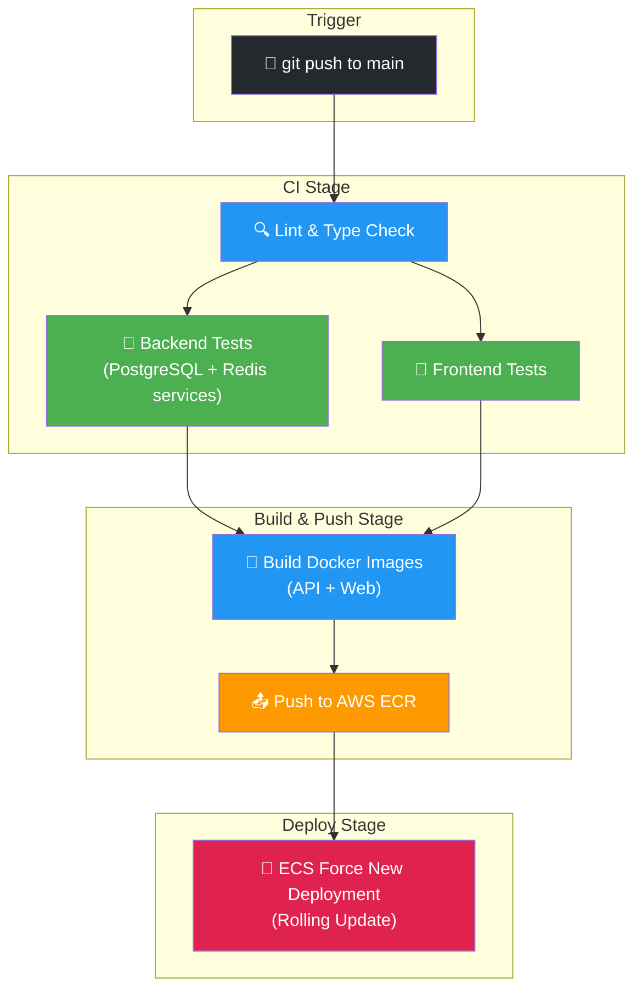
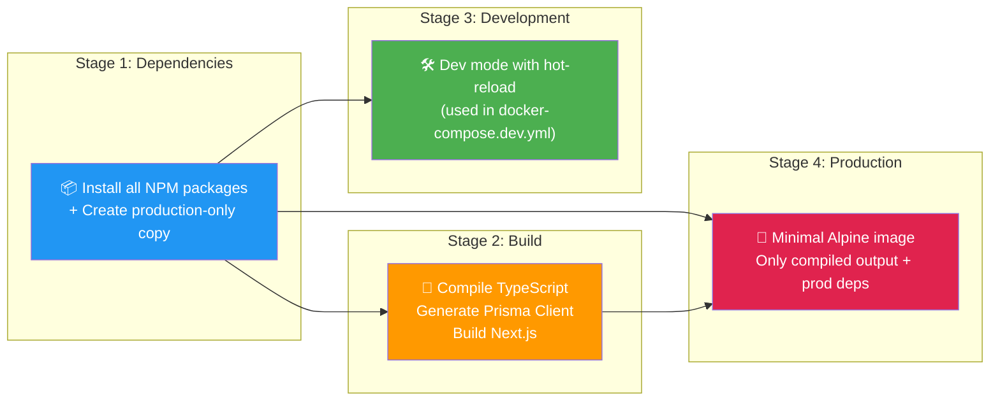
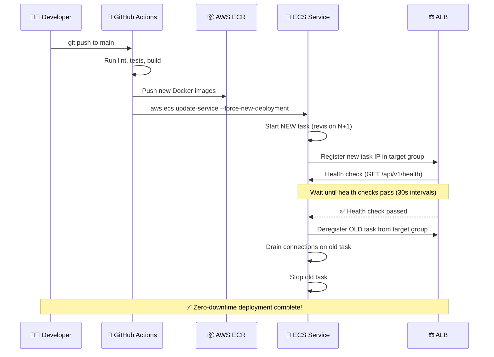

# BuildTrack — AWS Cloud Deployment Documentation

## Part 3: CI/CD Pipeline, Docker Strategy, Monitoring & Interview Q&A

---

## 9. CI/CD Pipeline — GitHub Actions

### 9.1 Pipeline Architecture



### 9.2 Pipeline Stages Explained

| Stage | Job | What It Does | Runs On |
|:---|:---|:---|:---|
| **1. Lint** | `lint` | Runs ESLint and TypeScript type-checking across all workspaces | Every push to `main` or `develop` |
| **2. Test API** | `test-api` | Runs Jest unit tests with a real PostgreSQL 16 + Redis 7 service container | After lint passes |
| **3. Test Web** | `test-web` | Runs frontend tests (if defined) | After lint passes |
| **4. Build** | `build` | Validates that the full application compiles cleanly | After all tests pass |
| **5. Push Images** | `push-images` | Builds Docker images and pushes to AWS ECR with `latest` + `sha` tags | Only on `main` branch |
| **6. Deploy** | `deploy` | Triggers ECS rolling deployment for both API and Web services | Only on `main` branch |

### 9.3 GitHub Secrets Required

| Secret Name | Value | Purpose |
|:---|:---|:---|
| `AWS_ACCESS_KEY_ID` | IAM user access key | Authenticate with AWS ECR and ECS |
| `AWS_SECRET_ACCESS_KEY` | IAM user secret key | Authenticate with AWS ECR and ECS |

### 9.4 Pipeline File Location

```
.github/workflows/ci.yml
```

---

## 10. Docker Build Strategy

### 10.1 Multi-Stage Builds

Both the API and Web Dockerfiles use a **4-stage multi-stage build** pattern to minimize the final production image size:



### 10.2 Image Size Optimization

| What | Why |
|:---|:---|
| **`node:20-alpine`** base | Alpine Linux is ~5MB vs ~900MB for full Debian. Reduces image size by 95%. |
| **Separate prod dependencies** | `npm install --omit=dev` creates a clean copy without devDependencies (Prisma CLI, Jest, ESLint, etc.) |
| **Only copy compiled output** | The production stage copies `dist/` (API) or `.next/` (Web) instead of the entire source tree |
| **No source code in production** | TypeScript source files are never included in the final image |

### 10.3 API Dockerfile Walkthrough

```dockerfile
# Stage 1: Install dependencies (both dev and prod)
FROM node:20-alpine AS dependencies
WORKDIR /app
COPY package.json ./
RUN npm install --omit=dev --legacy-peer-deps && cp -R node_modules /prod_modules
RUN npm install --legacy-peer-deps

# Stage 2: Compile TypeScript and generate Prisma client
FROM node:20-alpine AS build
WORKDIR /app
COPY --from=dependencies /app/node_modules ./node_modules
COPY . .
RUN npm run db:generate    # Generate Prisma Client
RUN npm run build          # Compile NestJS (TypeScript → JavaScript)

# Stage 4: Production (minimal image)
FROM node:20-alpine AS production
WORKDIR /app
ENV NODE_ENV=production
COPY --from=dependencies /prod_modules ./node_modules   # Only prod deps
COPY --from=build /app/dist ./dist                      # Compiled JavaScript
COPY --from=build /app/prisma ./prisma                  # Prisma schema files
COPY --from=build /app/node_modules/.prisma ./node_modules/.prisma  # Generated client
COPY package.json ./
EXPOSE 4000
CMD ["node", "dist/src/main"]
```

---

## 11. Deployment Workflow

### 11.1 How a Rolling Deployment Works



### 11.2 Manual Deployment (Without CI/CD)

If you need to deploy manually without GitHub Actions:

```bash
# 1. Build and push images
./push-to-ecr.sh

# 2. Force new deployment
aws ecs update-service --cluster buildtrack-cluster \
  --service buildtrack-api-service --force-new-deployment

aws ecs update-service --cluster buildtrack-cluster \
  --service buildtrack-web-service --force-new-deployment
```

---

## 12. Monitoring & Troubleshooting

### 12.1 Useful AWS CLI Commands

```bash
# Check running tasks
aws ecs list-tasks --cluster buildtrack-cluster

# Describe task status (PENDING, RUNNING, STOPPED)
aws ecs describe-tasks --cluster buildtrack-cluster --tasks <TASK_ID>

# Check why a task stopped
aws ecs describe-tasks --cluster buildtrack-cluster --tasks <TASK_ID> \
  --query "tasks[*].[stoppedReason]"

# View API container logs
aws logs filter-log-events --log-group-name "/ecs/buildtrack-api" --limit 50

# Filter for errors only
aws logs filter-log-events --log-group-name "/ecs/buildtrack-api" \
  --filter-pattern "ERROR" --limit 10

# Check service deployment status
aws ecs describe-services --cluster buildtrack-cluster \
  --services buildtrack-api-service buildtrack-web-service \
  --query "services[*].[serviceName,desiredCount,runningCount]"
```

### 12.2 Common Issues & Solutions

| Issue | Symptom | Root Cause | Solution |
|:---|:---|:---|:---|
| **CORS Error** | "Not allowed by CORS" in browser console | `APP_URL` env variable doesn't match the domain in the browser | Update `APP_URL` in the API task definition to match your domain (e.g., `https://build.synccent.com`) |
| **503 Service Unavailable** | ALB returns 503 | No healthy targets in the target group | Check if ECS tasks are running. Check CloudWatch logs for startup errors. |
| **Task keeps stopping** | Tasks cycle between PENDING → RUNNING → STOPPED | Health check failure or application crash | Check `stoppedReason` via `describe-tasks`. Review CloudWatch logs for errors. |
| **Cloudflare Error 1016** | "Origin DNS error" | CNAME target has a typo or trailing space | Re-enter the ALB DNS name exactly in Cloudflare DNS settings |
| **Database connection refused** | Prisma connection error in logs | ECS security group not allowed in RDS security group | Add inbound rule on `buildtrack-db-sg` allowing TCP 5432 from `buildtrack-ecs-tasks-sg` |

---

## 13. Cost Analysis

### Monthly Cost Breakdown

| Service | Specification | Free Tier? | Monthly Cost |
|:---|:---|:---|:---|
| **ECS Fargate** | 2 tasks × 0.25 vCPU × 0.5 GB RAM × 730 hours | ❌ No | **~$18.00** |
| **Application Load Balancer** | 1 ALB running 24/7 + minimal LCU usage | ❌ No | **~$17.00** |
| **RDS PostgreSQL** | db.t4g.micro (750 free hours/month) + 20GB storage | ✅ First 12 months | **$0.00** |
| **S3 Storage** | Up to 5GB standard storage | ✅ First 12 months | **$0.00** |
| **ECR** | 500MB free private storage | ✅ Always free | **$0.00** |
| **CloudWatch Logs** | 5GB ingestion free | ✅ Always free | **$0.00** |
| **Cloudflare** | Free plan (SSL, CDN, DDoS) | ✅ Always free | **$0.00** |
| **Data Transfer** | 100GB/month free outbound | ✅ First 12 months | **$0.00** |
| | | **TOTAL** | **~$35.00/month** |

> [!TIP]
> **Cost Optimization**: Scale ECS services to 0 tasks when not in use (e.g., overnight) to reduce Fargate costs by 50%+:
> ```bash
> # Scale down (stop all containers)
> aws ecs update-service --cluster buildtrack-cluster --service buildtrack-api-service --desired-count 0
> aws ecs update-service --cluster buildtrack-cluster --service buildtrack-web-service --desired-count 0
>
> # Scale up (restart containers)
> aws ecs update-service --cluster buildtrack-cluster --service buildtrack-api-service --desired-count 1
> aws ecs update-service --cluster buildtrack-cluster --service buildtrack-web-service --desired-count 1
> ```

---

## 14. Interview Q&A — Key Deployment Questions

### Q1: Why did you choose ECS Fargate over plain EC2?
> **A:** EC2 requires manual server management — patching, OS updates, monitoring disk space, configuring auto-scaling groups. With ECS Fargate, AWS manages all the underlying infrastructure. We define our containers, specify CPU/memory, and AWS handles provisioning, scaling, and security patching. This lets us focus on application code rather than infrastructure operations.

### Q2: Why not use Kubernetes (EKS)?
> **A:** EKS has a fixed control plane cost of ~$73/month regardless of workload size. For a project with 2 services, that's overkill. ECS Fargate provides equivalent container orchestration (service discovery, rolling deployments, health checks) at a fraction of the cost. If the project grows to 10+ microservices, migrating to EKS would make sense.

### Q3: How does your CORS configuration work in production?
> **A:** The NestJS backend reads the `APP_URL` environment variable to determine which origins are allowed. In production, this is set to `https://build.synccent.com`. The CORS middleware validates the `Origin` header of every incoming request against this allowlist. Requests from unauthorized origins are rejected with a 403 error. This prevents cross-site request forgery attacks.

### Q4: How does the Redis sidecar pattern work?
> **A:** In ECS Fargate, containers within the same task share a network namespace (similar to Kubernetes pods). By running Redis as a sidecar container alongside the API container, they communicate via `localhost:6379` with zero network latency. This eliminates the need for Amazon ElastiCache (~$15/month) while providing the same functionality for JWT session caching and BullMQ job queues.

### Q5: How do you handle zero-downtime deployments?
> **A:** ECS uses a rolling deployment strategy. When a new image is pushed, ECS starts a new task with the updated image, registers it with the ALB target group, and waits for health checks to pass. Only after the new task is confirmed healthy does ECS deregister and stop the old task. During this transition, both old and new tasks serve traffic, ensuring zero downtime.

### Q6: How does Cloudflare integrate with your AWS infrastructure?
> **A:** Cloudflare acts as a reverse proxy in front of our ALB. DNS for `build.synccent.com` points to Cloudflare's edge network (orange cloud proxy). Cloudflare terminates SSL/TLS, provides DDoS protection and CDN caching, then forwards the decrypted HTTP request to our ALB. This gives us free SSL certificates and global performance optimization without any AWS Certificate Manager configuration.

### Q7: How does the ALB route traffic to the correct service?
> **A:** The ALB uses **path-based routing rules**. A listener rule with priority 10 matches any request where the path starts with `/api/*` or `/socket.io/*` and forwards it to the API target group (NestJS on port 4000). All other requests fall through to the default rule, which forwards to the Web target group (Next.js on port 3000). This means a single load balancer serves both frontend and backend.

### Q8: What is your CI/CD pipeline flow?
> **A:** On every push to the `main` branch, GitHub Actions runs: (1) Lint and type-check, (2) Backend tests against real PostgreSQL and Redis service containers, (3) Frontend tests, (4) Docker image builds pushed to AWS ECR with both `latest` and git SHA tags, (5) ECS force-new-deployment that triggers a rolling update. The entire pipeline runs in ~5 minutes with zero manual intervention.

### Q9: How do you manage database migrations in production?
> **A:** We use Prisma ORM with a multi-file schema architecture (14 separate `.prisma` files for different modules). Migrations are generated locally with `prisma migrate dev` and committed to Git. In production, `prisma migrate deploy` applies only pending migrations without generating new ones. This ensures the production schema always matches the codebase version.

### Q10: How would you scale this architecture?
> **A:** Three dimensions of scaling:
> 1. **Horizontal**: Increase `desired-count` on ECS services (e.g., from 1 to 3 tasks). The ALB automatically distributes traffic.
> 2. **Vertical**: Increase CPU/memory in the task definition (e.g., from 0.25 vCPU to 1 vCPU).
> 3. **Database**: Upgrade RDS instance class (e.g., `db.t4g.medium`) or add read replicas for read-heavy workloads.
> 4. **Cache**: If Redis sidecar becomes a bottleneck, migrate to ElastiCache with a dedicated cluster.

---

## 15. Production URLs

| Resource | URL |
|:---|:---|
| **Live Website** | [https://build.synccent.com](https://build.synccent.com) |
| **API Health Check** | [https://build.synccent.com/api/v1/health](https://build.synccent.com/api/v1/health) |
| **AWS ECS Console** | [https://console.aws.amazon.com/ecs](https://console.aws.amazon.com/ecs) |
| **GitHub Repository** | [https://github.com/YanushkaKumar/construction-tracker](https://github.com/YanushkaKumar/construction-tracker) |

### Demo Credentials

| Role | Email | Password |
|:---|:---|:---|
| Company Owner | `owner@lankabuild.lk` | `BuildTrack@2026` |
| Project Manager | `pm@lankabuild.lk` | `BuildTrack@2026` |
| Site Engineer | `engineer@lankabuild.lk` | `BuildTrack@2026` |
